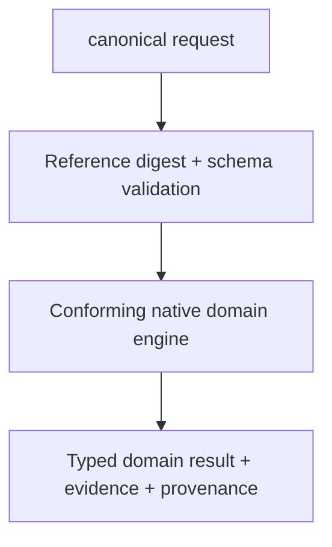

# LogicEngine Interface Contract

## Common shape

Each execution protocol refines `CircuiteFoundation.Engine` with one domain
request and result pair. Canonical requests carry a `SchemaVersion`, run ID,
and digest-bearing `ArtifactReference` values. Results keep domain metrics while
conforming directly to `ArtifactProducing`, `DiagnosticReporting`, and
`EvidenceProviding`.

## Products

### LogicLowering

Converts a finalized `LogicDesignSnapshot` from `LogicDesign` into the
versioned `LogicDesignDocument` execution artifact consumed by simulation and
synthesis. `NativeLogicDesignLowering` is deterministic and returns `blocked`
for RTL constructs whose semantics are not preserved by the current profile.

### LogicSimulation

Event-driven RTL and gate simulation.

### LogicSynthesis

Optimization and technology mapping.

### LogicEngine

Umbrella API without a combined execution protocol.

### LogicEvidence

`LogicEvidenceSuite` contains versioned, agent-operable cases whose typed
requests are executed through `LogicEvidenceExecuting`. The native runner
records status, diagnostic codes, artifact IDs, and mismatches for every case.
`NativeLogicEvidenceOracleCorrelator` compares those observations with a
separately identified `LogicEvidenceOracleObservationSet`; missing cases,
extra cases, status/code differences, or non-independent identities prevent
promotion to `oracleCorrelated`.

`LogicEvidenceReport` records only `unassessed`, `corpusChecked`, and
`oracleCorrelated` maturity. It validates suite, implementation, case, and
independent-observation identity, but it cannot promote itself to process trust
or release eligibility. ToolQualification consumes these retained observations
with tool, environment, and process evidence. DesignFlowKernel and Xcircuite own
release policy, approval, and resume.

## Native implementations

`LogicEquivalenceFlowStageExecutor` is the Xcircuite-owned stage executor for
the typed `LogicSynthesisEquivalenceRequest`. It invokes the conforming engine
protocol directly and maps the declared
`rtl-to-mapped-structural` scope to RTLVerificationEngine's
`rtlToMappedExecutionStructural` proof view, persists the verification report,
equivalence evidence, and synthesis acceptance record, and blocks the flow
unless the acceptance evaluator returns `accepted`. It also emits review and
audit artifacts with a deterministic request digest for human inspection and
resume bookkeeping.

`NativeLogicDesignLowering`, `NativeLogicSimulationEngine`,
`NativeLogicSynthesisEngine`, and
`NativeLogicUnboundedTemporalEquivalenceEngine` are the native domain
implementations. They conform directly to their Foundation-refining domain
protocols, accept `LogicDesignArtifact` values, and return canonical records
containing `ArtifactReference`,
`DesignDiagnostic`, and `EvidenceManifest` values. The default filesystem
store still verifies SHA-256 and byte-count provenance on reads and writes
immutable run-scoped output references.

The execution graph schema is versioned by `LogicDesignDocument`. Supported node
kinds are `and`, `or`, `xor`, `nand`, `nor`, `xnor`, `not`, `buffer`, `constant`,
`concat`, `slice`, `case_equal`, `case_not_equal`, `equal`, `not_equal`,
`less_than`, `less_equal`, `greater_than`, `greater_equal`, `add`, `subtract`,
`multiply`, `divide`, `modulo`, `shift_left`, `shift_right`, `mux`, `tri_state`,
`dff`, and `latch`. A node kind outside this set produces
`LOGIC_SEMANTICS_UNSUPPORTED` with `blocked` status.

The retained native RTL lowering profile accepts positive- and negative-edge
non-blocking sequential assignments, synchronous and asynchronous reset paths,
complete-branch conditionals/plain case, static projections, scalar/vector
logical operations, comparisons, division/modulo, unsigned and signed arithmetic
within the declared 64-bit profile, and level-sensitive latch conditionals. It
returns structured blocked diagnostics for sequential blocking assignments,
ambiguous or unsupported multi-event sensitivity, wildcard case, hierarchy,
unsupported arithmetic widths, and dynamic projections. Native execution
validates single-driver and acyclic combinational topology before simulation,
mapping, or exhaustive proof.
Every successful native synthesis result also emits a
`LogicSynthesisEquivalenceRequest` artifact and reports
`acceptanceState=pendingEquivalence`; the mapped design is not a release
acceptance claim until a later verification stage resolves that request.

`NativeLogicUnboundedTemporalEquivalenceEngine` is exact for the
declared finite execution graph. It enumerates all two-state or four-state
input/state assignments, compares current outputs and next-state values, and
persists a report plus a certificate bound to the request and report digests.
It emits a counterexample for a mismatch and a structured blocked or timeout
result when the graph, limits, or execution budget cannot support a proof. This
scope is not a general SystemVerilog or DFT solver.

## Error contract

- Throw only when execution cannot produce a valid typed domain result.
- Represent design findings and failed checks as typed diagnostics and a completed domain payload.
- Represent missing prerequisites or insufficient semantics as `blocked`.
- Preserve cancellation as `cancelled`.
- Do not swallow parser, process or persistence failures.

## Flow integration

The Xcircuite-owned stage executor must:

1. resolve project-relative references through the injected Xcircuite workspace store;
2. verify input digests;
3. evaluate ToolQualification requirements;
4. invoke the injected engine protocol;
5. persist every returned artifact;
6. map diagnostics and status to FlowStageResult;
7. attach design, PDK and tool provenance;
8. persist review and audit artifacts with a request digest;
9. reuse a valid persisted equivalence result only after validating the result,
   evidence, acceptance, review, audit, and file integrity contracts.
