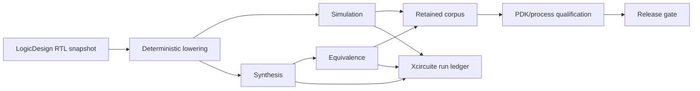

# LogicEngine Milestones

This roadmap treats LogicEngine as a digital-design execution and qualification
boundary, not as a standalone gate simulator. The end state is a reproducible,
reviewable path from canonical RTL and power intent to simulation, synthesis,
equivalence, physical handoff, and release evidence.

## Milestone 0: Boundary and evidence baseline

Status: complete.

Exit criteria:

- LogicDesign owns canonical RTL, gate IR, SystemVerilog parsing/elaboration,
  and power-intent parsing.
- LogicEngine owns execution-facing lowering, simulation, synthesis, and their
  typed artifacts.
- RTLVerificationEngine owns lint, CDC/RDC, and equivalence protocols.
- Xcircuite owns orchestration, trust gates, persistence, approval, resume, and
  repair loops.
- Native implementation, corpus validation, oracle correlation, process
  qualification, and release approval are reported separately.

## Milestone 1: Canonical execution contract and deterministic lowering

Status: complete for the retained native lowering profile.

Depends on: Milestone 0.

Exit criteria:

- A finalized `LogicDesignSnapshot` can be lowered into a versioned
  `LogicDesignDocument` without UI or ad-hoc string state.
- Supported RTL expressions and assignments preserve source digest, top name,
  widths, and transformation provenance.
- Unsupported RTL constructs return stable `blocked` diagnostics with affected
  source entities and recovery actions.
- Lowered artifacts are digest-verifiable and deterministic across runs.
- Positive, negative, round-trip, and width/error fixtures are retained.

Evidence:

- LogicEngine lowering, artifact, and native simulation handoff tests pass.
- Xcircuite lowering, simulation, and synthesis adapter tests pass.
- Repeated lowering runs produce byte-identical execution-design artifacts.

Current slice:

- identifiers, constants, bitwise unary operators, bitwise binary operators,
  scalar/vector logical operators and logical NOT, ternary expressions, concatenation, static vector
  projections, continuous assignments, plain case statements, unsigned and signed arithmetic,
  signed negative literals, arithmetic right shift, positive/negative-edge sequential
  assignments, synchronous reset data paths, sampled non-blocking updates, and
  asynchronous reset event metadata, generic `always @*` and explicit sensitivity-list
  combinational processes,
  explicit native topology checks for multiple drivers and combinational cycles,
  comparison, division, modulo, and level-sensitive latch nodes.

## Milestone 2: Complete native RTL execution semantics

Status: complete for the retained native execution profile; broader RTL
coverage remains an explicit `LogicDesign` frontend expansion track.

Depends on: Milestone 1.

Exit criteria:

- Procedural blocks, blocking/non-blocking scheduling, reset behavior, clock
  domains, conditionals, case statements, concatenation, indexing, and part
  selects have explicit semantics or explicit blocked boundaries.
- Width, signedness, four-state propagation, multiple drivers, and combinational
  cycle behavior are validated before execution.
- Simulation produces deterministic VCD/FST artifacts, assertion reports,
  cancellation records, and reproducible metrics.
- A retained RTL corpus covers positive and negative semantics.

Current implementation slice:

- Supported: positive- and negative-edge non-blocking sequential assignments,
  synchronous and asynchronous reset data paths, complete-branch conditionals/plain case, generic
  `always @*` combinational processes, concatenation,
  static index/part-select, exact four-state case equality, scalar/vector
  logical operators and logical NOT, unsigned and signed
  arithmetic within the 64-bit native profile, signed negative literals,
  arithmetic right shift, and deterministic sampled updates.
- Explicitly blocked: sequential blocking assignments, unsupported multi-event
  clock sensitivity, hierarchy, wildcard case semantics, dynamic projections,
  and unsupported arithmetic widths. Level-sensitive latches, comparisons,
  division, and modulo are represented by explicit native nodes and evaluated
  by the shared simulation/proof evaluator.
- Validated before native execution: multiple drivers, reset-control width,
  and structural combinational cycles, including cycles with stable unknown
  values.
- Simulation cancellation persists a run-scoped structured cancellation record
  alongside the cancelled envelope.

## Milestone 3: Synthesis correctness and acceptance

Status: complete for the LogicEngine-owned native mapping and acceptance
profile. The mapped-design handoff remains `pendingEquivalence` until a
downstream proof stage supplies matching evidence.

Depends on: Milestone 2.

Exit criteria:

- Lowering, optimization, technology mapping, timing/area/power constraints,
  and power-intent effects are represented in provenance.
- Optimizations have explicit preconditions and transformation records.
- Every mapped design has an equivalence request and cannot be promoted to an
  accepted result without an equivalence artifact.
- Qualified Liberty/PDK inputs and unqualified-cell failure paths are retained.
- A successful mapped result emits a digest-bearing
  `LogicSynthesisEquivalenceRequest` and remains `pendingEquivalence` until a
  later verification stage provides acceptance evidence.
- The native acceptance evaluator advances only matching `proved` evidence and
  rejects run, digest, scope, blocked, and unproven mismatches.
- Xcircuite consumes the request, invokes the RTLVerification mapped-execution
  proof view, persists proof/evidence/acceptance artifacts, and only passes the
  flow gate when the acceptance evaluator returns `accepted`; this orchestration
  remains outside the LogicEngine package.

## Milestone 4: Verification and oracle correlation

Status: complete for the declared native execution-graph profile. LogicEngine
provides bounded trace comparison and exact exhaustive finite-state temporal
equivalence with digest-bound reports/certificates; general RTL/DFT solver
protocol execution remains the `RTLVerificationEngine` boundary.

Depends on: Milestone 3.

Exit criteria:

- LogicEngine can hand off source and mapped designs to RTLVerificationEngine's
  equivalence protocol using digest-bearing references.
- Structural equivalence, unsupported semantics, counterexamples, and solver
  selection are represented as machine-readable artifacts.
- The retained native bridge proves only canonical LogicEngine execution-graph
  equivalence; it does not claim temporal RTL-to-synthesized or DFT proof.
- At least one reference-oracle correlation corpus is retained and reproducible.
- The native LogicQualification CLI can attach independent observations and
  promote a corpus from `corpusChecked` to `oracleCorrelated` only when every
  case, status, diagnostic code, and implementation identity matches.
- Qualification reports are persisted as JSON artifacts and validated before
  Xcircuite uses their state; forged release states are rejected.
- Native bounded temporal trace comparison uses the same finite stimulus for
  reference and implementation execution graphs, enforces a sample bound,
  persists role-qualified reports/counterexamples, and reports the remaining
  general RTL solver requirement explicitly.
- Native exhaustive temporal equivalence explores the complete declared
  two-state or four-state finite relation, including combinational, DFF, and
  level-sensitive latch graphs, and emits a request/report-bound proof
  certificate or a structured counterexample/block/timeout result.

## Milestone 5: Xcircuite execution and human-in-the-loop

Status: complete for the LogicEngine-owned adapter and evidence contracts. The
Xcircuite runtime still owns orchestration, review/resume policy, and human
approval execution.

Depends on: Milestones 1–4.

Exit criteria:

- Elaboration, lowering, simulation, synthesis, and equivalence adapters resolve
  and verify inputs, persist raw/canonical artifacts, and attach provenance.
- Run manifests, design diffs, review reports, approval, cancellation, resume,
  and repair-loop handoffs preserve immutable evidence.
- Logic equivalence resume validates request digest, result envelope, evidence,
  acceptance, review, audit, and artifact integrity before reusing a result.
- Headless integration tests run against the complete dependency graph; the
  current regression passed 557 tests in 59 suites. The focused LogicEngine,
  LogicDesign, runtime specification, and RTL oracle lanes passed 7, 3, 35,
  and 6 tests respectively.

## Milestone 6: Process qualification and release eligibility

Status: complete for the retained local native process profile. The package
ships independent oracle, process/PDK, and human approval fixtures that the
`logic-engine qualify` command can reproduce through `releaseEligible`.
Foundry-specific qualification remains a separate process scope.

Promotion beyond oracle correlation requires a typed process evidence artifact
bound to the suite, implementation, SHA-256 PDK digest, digest-bearing
input/output artifacts, metrics, failures, and environment identity. Release
eligibility additionally requires a separate human approval artifact; neither
gate is inferred from a passing fixture.

Depends on: Milestones 1–5.

Exit criteria:

- Versioned corpus coverage is retained for every P0 semantic, including
  positive, counterexample, limit, timeout, and unsupported-proof cases.
- Oracle correlation and process/PDK qualification records include tool version,
  inputs, outputs, metrics, failures, and environment identity.
- Tool trust gates distinguish smoke-tested, qualified, and release-approved
  results.
- Release eligibility is reproducible from immutable run artifacts.

## Milestone 7: Qualified unbounded temporal equivalence

Status: complete for the native exhaustive finite-state proof scope. No claim
is made for arbitrary SystemVerilog, synthesized DFT, or symbolic solver
theorems; those remain external verification scopes.

Depends on: Milestones 4–6.

Scope:

- Bind a native exhaustive implementation to the typed Foundation request and
  immutable request/report/certificate digests. An external solver can be
  attached later through `RTLVerificationEngine` without changing the artifact
  contract.
- Require a digest-bearing proof certificate or counterexample, solver/tool
  identity, timeout/process diagnostics, assumptions, and exact request/result
  digests before a result can be promoted.
- Preserve the same review, audit, approval, and resume contract as native
  equivalence; a bounded trace match cannot substitute for this gate.

Exit criteria:

- A retained native corpus covers passing, counterexample, limit-blocked,
  timeout, unsupported-semantics, four-state, DFF, latch, and
  tampered-certificate cases.
- The independent oracle, process/PDK evidence, and human approval fixtures
  promote the native corpus through `releaseEligible` for the local fixture
  process scope.
- The result persists and revalidates request/report/certificate digests and
  exposes the proof scope explicitly for Xcircuite resume and review.
- Release readiness remains blocked for any proof scope outside the declared
  native finite-state profile or without a separately qualified process scope.

## Promotion policy

A milestone is not complete because source types exist or a happy-path test
passes. Promotion requires implementation, structured failure behavior,
retained corpus evidence, relevant integration evidence, and an explicit
qualification boundary. A missing external oracle or PDK is a recorded gate,
not a reason to claim completion.
