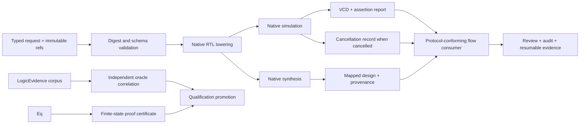

# LogicEngine

Functional logic simulation and logic synthesis over LogicDesign.

## Status

The package provides a native, deterministic execution backend for the versioned
`LogicDesignDocument` execution graph. Simulation, synthesis, bounded temporal
trace comparison, and exhaustive finite-state temporal equivalence remain
separate products. The native proof is exact for its declared graph, value
domain, and limits; full SystemVerilog/DFT theorem proving and foundry-specific
qualification remain external scopes.

## Products

| Product | Responsibility |
|---|---|
| `LogicLowering` | Deterministic RTL snapshot to execution-graph lowering |
| `LogicSimulation` | Event-driven RTL and gate simulation |
| `LogicSynthesis` | Optimization and technology mapping |
| `LogicEvidence` | Retained corpus execution, independent oracle correlation, process evidence, and promotion state |
| `LogicEngine` | Umbrella API without a combined execution protocol |
| `LogicSynthesis` equivalence boundary | Bounded temporal trace comparison and exhaustive finite-state proof with digest-bearing reports, certificates, and counterexamples |

`LogicEngineCore` contains the execution artifact schema, four-state values,
stimulus/assertion records, cell-library and constraint records, provenance, typed
diagnostics, and a root-bounded filesystem artifact store with symlink-escape
rejection, atomic publication and immutable collision detection.

## Contract

Every design execution product exposes a Foundation-native boundary:

- a typed `Codable`, `Hashable`, `Sendable` request using `ArtifactReference`;
- a typed result conforming to `ArtifactProducing`, `DiagnosticReporting`, and
  `EvidenceProviding`;
- a domain protocol refining `CircuiteFoundation.Engine`;
- explicit blocked, failed, and cancelled states with `ExecutionProvenance`.

The Foundation-native domain engines are the public execution boundary. Flow
and project storage are injected by `DesignFlowKernel` and `Xcircuite`; this
package does not expose a compatibility envelope or storage facade.
`LogicEvidence` remains the package-owned qualification lifecycle: it
consumes execution observations and qualification evidence, but is not itself
an execution engine or a Foundation replacement for the qualification schema.

Native implementations:

- `NativeLogicDesignLowering` converts a finalized `LogicDesignSnapshot` into a
  digest-bearing execution graph and blocks semantics it cannot preserve. It
  supports complete `always_comb` and generic `always @*` combinational
  processes with blocking assignments, comparison/division/modulo expressions,
  and the supported level-sensitive latch profile.
- `NativeLogicSimulationEngine` evaluates combinational gates, muxes, tri-state
  nodes, constants, concatenation, static vector slices, exact case matching,
  scalar and vector logical `&&`/`||`, logical `!`, comparisons, division/modulo,
  level-sensitive latches, unsigned and signed arithmetic within
  the native 64-bit profile, signed negative literals, arithmetic right
  shifts, and positive- or negative-edge DFFs with
  `0/1/X/Z` values. Clock and asynchronous-reset event metadata is preserved
  in the lowered DFF parameters, and reset assertion updates state without a
  clock edge. Sequential nodes sample all inputs before applying
  non-blocking updates. Native topology validation rejects multiple drivers and
  combinational cycles before execution; sequential blocking assignments,
  ambiguous or unsupported multi-event clock sensitivity, wildcard case,
  unsupported arithmetic widths, hierarchy, and dynamic projections are explicit
  blocked boundaries.
  Mixed signed/unsigned arithmetic follows the unsigned operation profile.
- `NativeLogicBoundedTemporalEquivalenceEngine` runs the same finite stimulus
  against two execution-design artifacts, compares declared output traces within
  an explicit sample bound, persists uniquely identified reports and counterexamples,
  and returns `proved`, `counterexample`, or `blocked`. This is bounded trace
  evidence and is separate from the exhaustive proof product.
- `NativeLogicUnboundedTemporalEquivalenceFoundationEngine` exhausts every
  declared input/state assignment in the selected two-state or four-state
  domain for combinational, DFF, and level-sensitive latch graphs. It enforces
  state/transition/timeout limits, persists a request/report-bound proof
  certificate on success, persists a counterexample on mismatch, and returns
  structured blocked or timeout diagnostics without claiming a proof.
- `NativeLogicSynthesisEngine` validates/lowers the execution graph, eliminates
  non-observable buffers, selects qualified cells, checks area/power/depth
  constraints, and emits mapped design, provenance, and a typed equivalence
  request. The synthesis payload remains `pendingEquivalence` until a later
  verification stage supplies acceptance evidence.
- FST output and unsupported node semantics return structured `blocked` results.

Foundation-native entry points are available as
`NativeLogicLoweringFoundationEngine`,
`NativeLogicSimulationFoundationEngine`,
`NativeLogicSynthesisFoundationEngine`, and
`NativeLogicBoundedTemporalEquivalenceFoundationEngine`, and
`NativeLogicUnboundedTemporalEquivalenceFoundationEngine`. They preserve the
domain metrics while projecting artifact identity, diagnostics, and provenance
to canonical Foundation types at the public cross-domain boundary.

## Xcircuite integration

Xcircuite may compose the package's public Foundation protocols with flow-stage
execution. Synthesis remains `pendingEquivalence` until an orchestrator consumes
its typed request, invokes an independently qualified mapped-execution proof,
and persists matching evidence plus an acceptance record. These stages share
canonical artifacts but never collapse result schemas or qualification claims.

The bounded and exhaustive temporal APIs are independently CLI-operable through
`logic-engine bounded-equivalence` and
`logic-engine foundation-unbounded-equivalence`. Flow orchestration and a
general RTL/DFT solver remain separate external boundaries.

The library does not depend on the Xcircuite runtime. A flow consumer conforms
its own concrete stage executor to `DesignFlowKernel` and invokes LogicEngine's
typed protocols directly; project persistence, repair loops and human approval
remain outside this package.

## Build

```bash
swift build
```

The deterministic JSON CLI is available as:

```bash
swift run logic-engine capabilities
swift run logic-engine lower --request path/to/lowering-request.json --root path/to/project
swift run logic-engine simulate --request path/to/simulation-request.json --root path/to/project
swift run logic-engine synthesize --request path/to/synthesis-request.json --root path/to/project
swift run logic-engine bounded-equivalence --request path/to/bounded-equivalence-request.json --root path/to/project
swift run logic-engine foundation-lower --request path/to/foundation-lowering-request.json --root path/to/project
swift run logic-engine foundation-simulate --request path/to/foundation-simulation-request.json --root path/to/project
swift run logic-engine foundation-synthesize --request path/to/foundation-synthesis-request.json --root path/to/project
swift run logic-engine foundation-bounded-equivalence --request path/to/foundation-equivalence-request.json --root path/to/project
swift run logic-engine foundation-unbounded-equivalence --request path/to/foundation-unbounded-equivalence-request.json --root path/to/project
```

The first group exposes LogicEngine's domain requests. The `foundation-*`
commands decode and execute the cross-package Foundation-native request types and print the
typed Foundation result, including artifact references, diagnostics, evidence,
and provenance. The retained Foundation fixtures under
`Tests/LogicEngineTests/Fixtures/foundation-*-request.json` are directly
executable from the package root. Both groups print sorted-key JSON. A
non-completed result
returns a non-zero exit status.

Qualification runs use a versioned suite and may attach an independently
generated observation set. A passing suite reports `corpusChecked`; a matching
independent observation set promotes it to `oracleCorrelated`. The retained
unbounded proof suite includes proved, counterexample, limit-blocked, timeout,
and unsupported-semantics cases; certificate tampering is covered by the
certificate validator tests.
Process qualification and release approval are separate optional inputs. They
must be bound to the suite and implementation; release eligibility is never
inferred from the fixture corpus alone.
Every qualification run also persists `logic-qualification-report.json` in the
selected output directory. Runtime consumers call report validation before
accepting a qualification state, so a forged release state cannot pass the
qualification gate.

```bash
swift run logic-engine qualify \
  --suite Tests/LogicEngineTests/Fixtures/logic-qualification-suite.json \
  --oracle Tests/LogicEngineTests/Fixtures/logic-qualification-oracle-v1.json \
  --root . \
  --output /tmp/logic-engine-qualification
```

Attach process and approval artifacts with `--process PATH` and
`--release-approval PATH` when those independently reviewed records exist.
The retained unbounded fixture process evidence and approval can be replayed
with `logic-unbounded-qualification-suite.json`, its oracle, process evidence,
and release approval to reach `releaseEligible` for the local fixture process.

## Test

Use the generated Swift Package Xcode scheme under an external 180-second
timeout:

```bash
perl -e '$SIG{ALRM}=sub { kill 9, $$ }; alarm 180; exec @ARGV' \
  xcodebuild test -scheme LogicEngine-Package -destination 'platform=macOS' \
  -derivedDataPath /tmp/logic-engine-xcodebuild
```

The workspace verifier records the result as a reproducible JSON report.

See `DESIGN.md`, `INTERFACES.md` and `IMPLEMENTATION_PLAN.md` before implementing a backend.

## Execution artifact boundary

The native backend consumes a versioned JSON graph referenced by
`LogicDesignReference`. The graph contains `ports`, `signals`, and `nodes`; each
node has an `id`, `kind`, `inputs`, `outputs`, and optional string parameters.
Stimulus artifacts contain timestamped assignments and assertions. Synthesis
library artifacts contain qualified cells keyed by node kind and input count.
These are execution artifacts, not UI state and not a replacement for the
canonical RTL or gate IR owned by `LogicDesign`.


```
